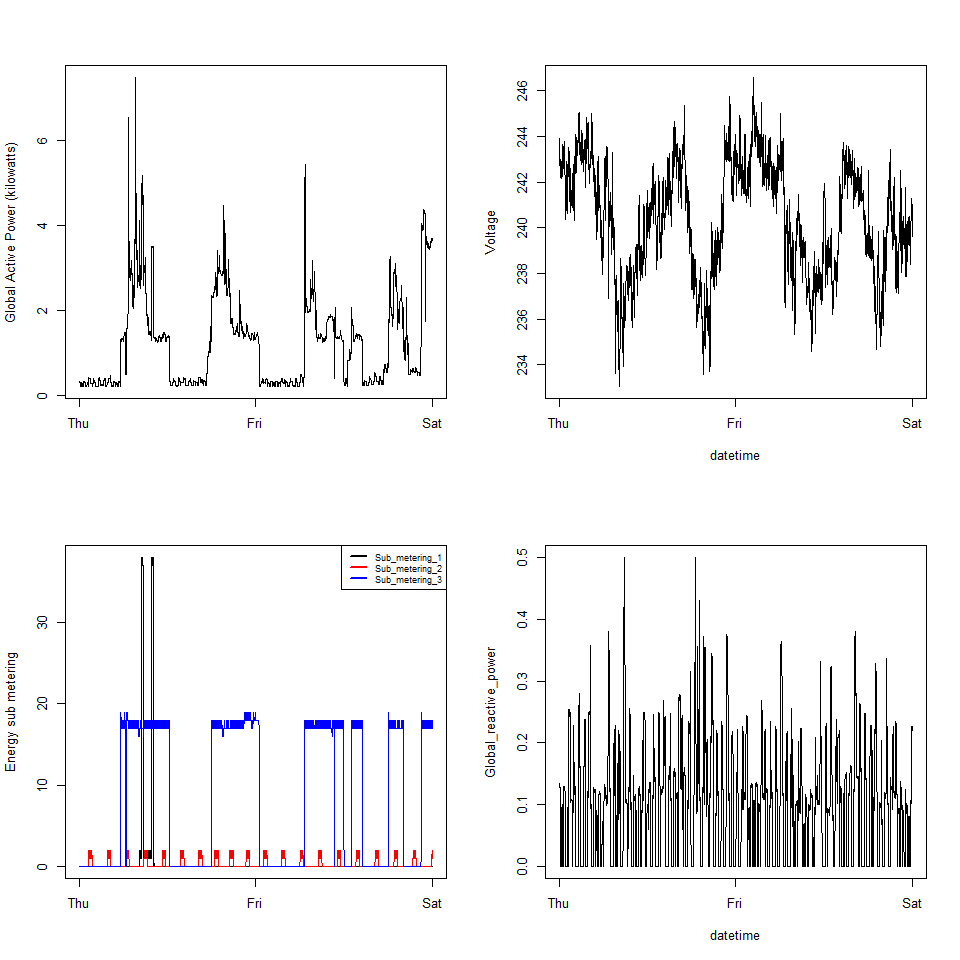

Exploratory data analysis project 1
================

This repo is forked from rdpeng/ExData\_Plotting1. This readme is an
update of the original readme and outlines the contents of my fork and
the code I executed to create the prescribed plots.

## Introduction

This assignment uses data from the UC Irvine Machine Learning
Repository, a popular repository for machine learning datasets. In
particular, we will be using the “Individual household electric power
consumption Data Set” which I have made available on the course web
site:

Dataset: Electric power consumption \[20Mb\]

Description: Measurements of electric power consumption in one household
with a one-minute sampling rate over a period of almost 4 years.
Different electrical quantities and some sub-metering values are
available.

The following descriptions of the 9 variables in the dataset are taken
from the UCI web site:

Date: Date in format dd/mm/yyyy Time: time in format hh:mm:ss
Global\_active\_power: household global minute-averaged active power (in
kilowatt) Global\_reactive\_power: household global minute-averaged
reactive power (in kilowatt) Voltage: minute-averaged voltage (in volt)
Global\_intensity: household global minute-averaged current intensity
(in ampere) Sub\_metering\_1: energy sub-metering No. 1 (in watt-hour of
active energy). It corresponds to the kitchen, containing mainly a
dishwasher, an oven and a microwave (hot plates are not electric but gas
powered). Sub\_metering\_2: energy sub-metering No. 2 (in watt-hour of
active energy). It corresponds to the laundry room, containing a
washing-machine, a tumble-drier, a refrigerator and a light.
Sub\_metering\_3: energy sub-metering No. 3 (in watt-hour of active
energy). It corresponds to an electric water-heater and an
air-conditioner.

*Only data from the dates 2007-02-01 and 2007-02-02.*

------------------------------------------------------------------------

## Repo Contents

-   Plots - Plot directory (find my plots in the following links or
    scrol down and see them in this readme)
    -   [plot1.png](https://github.com/liamswan/ExData_Plotting1/tree/master/plots/plot1.png)
    -   [plot2.png](https://github.com/liamswan/ExData_Plotting1/tree/master/plots/plot2.png)
    -   [plot3.png](https://github.com/liamswan/ExData_Plotting1/tree/master/plots/plot3.png)
    -   [plot4.png](https://github.com/liamswan/ExData_Plotting1/tree/master/plots/plot4.png)
-   Data - Data directory
    -   “household\_power\_consumption.txt”
-   plot1-4.R - R scripts for the coresponding plots
-   Setup.R - R script for setting up directories, downloading data,
    reading data and subsetting data
-   figures - master plot examples directory
-   README.md - master readme

------------------------------------------------------------------------

## Plot 1

``` r
par(mfrow = c(1,1))
hist(power_days$Global_active_power, 
     col = "red", 
     xlab = "Global Active Power (KilloWatts)", 
     main = "Global Active Power")
```

<!-- -->

------------------------------------------------------------------------

## Plot 2

``` r
par(mfrow = c(1,1))
with(power_days, 
     plot(Time, Global_active_power, type = "l",
          xlab = "",
          ylab = "Global Active Power (kilowatts)"))
```

<!-- -->

------------------------------------------------------------------------

## Plot 3

``` r
par(mfrow = c(1,1))
plot(power_days$Time, power_days$Sub_metering_1, type = "l", col = "black",
     xlab = "",
     ylab = "Energy sub metering")
lines(power_days$Time, power_days$Sub_metering_2, type = "l", col = "red")
lines(power_days$Time, power_days$Sub_metering_3, type = "l", col = "blue")
legend("topright",
       legend = c("Sub_metering_1", "Sub_metering_2", "Sub_metering_3"), 
       col = c("black", "red", "blue"),lty = 1, lwd = 2)
```

<!-- -->

------------------------------------------------------------------------

## Plot 4

``` r
par(mfrow = c(2,2))

with(power_days, 
     plot(Time, Global_active_power, type = "l",
          xlab = "",
          ylab = "Global Active Power (kilowatts)"))

with(power_days, 
     plot(Time, Voltage, type = "l",xlab = ""))    

plot(power_days$Time, power_days$Sub_metering_1, type = "l", col = "black",
     xlab = "",
     ylab = "Energy sub metering")
lines(power_days$Time, power_days$Sub_metering_2, type = "l", col = "red")
lines(power_days$Time, power_days$Sub_metering_3, type = "l", col = "blue")
legend("topright",
       legend = c("Sub_metering_1", "Sub_metering_2", "Sub_metering_3"), 
       col = c("black", "red", "blue"),
       lty = 1, lwd = 2,
       cex = 0.7)

with(power_days, 
     plot(Time, Global_reactive_power, type = "l",xlab = ""))  
```

<!-- -->

------------------------------------------------------------------------
